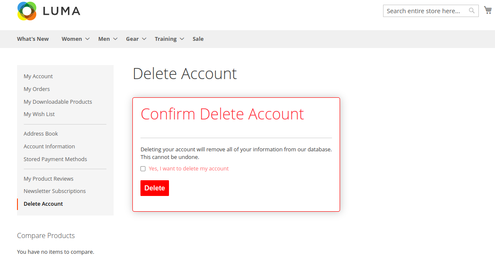
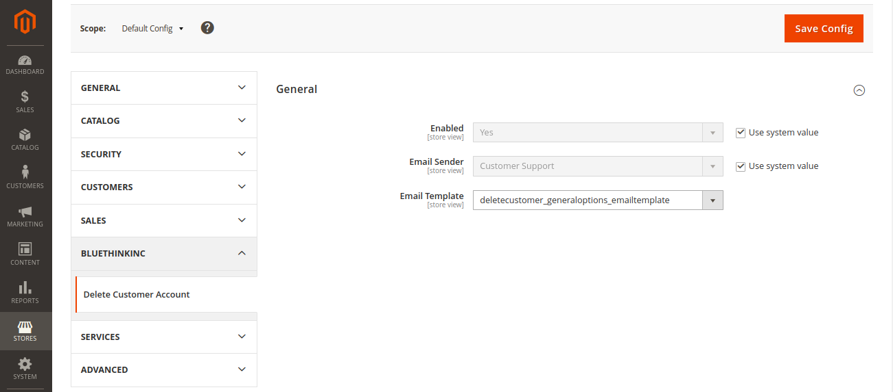

# Module BluethinkInc DeleteCustomer

   ``bluethinkinc/module-deletecustomer``

## Main Functionalities
This extension helps the customer to delete their account.
In the customer's my account section customer can delete their account with the confirmation dialog box.

## Installation
\* = in production please use the `--keep-generated` option

### Type 1: Zip file

 - Download .zip file and extract to `app/code/BluethinkInc` folder. If Bluethinkinc folder does not exist then create it in your `app/code` folder
 - Enable the module by running `php bin/magento module:enable BluethinkInc_DeleteCustomer`
 - Apply database updates by running `php bin/magento setup:upgrade`
 - Compilation by running `php bin/magento setup:di:compile`
 - Static Content deploy by running `php bin/magento setup:static-content:deploy`
 - Flush the cache by running `php bin/magento cache:flush`

### Type 2: Composer

 - Make the module available in a composer repository for example:
    - private repository `repo.magento.com`
    - public repository `packagist.org`
    - public github repository as vcs
 - Add the composer repository to the configuration by running `composer config repositories.repo.magento.com composer https://repo.magento.com/`
 - Install the module composer by running `composer require bluethinkinc/module-deletecustomer`
 - enable the module by running `php bin/magento module:enable BluethinkInc_DeleteCustomer`
 - apply database updates by running `php bin/magento setup:upgrade`
 - Compilation by running `php bin/magento setup:di:compile`
 - Static Content deploy by running `php bin/magento setup:static-content:deploy`
 - Flush the cache by running `php bin/magento cache:flush`

## Configuration

 - In the configuration file there are 3 fields:

 - Go to Admin -> Stores -> Configuration -> BluethinkInc -> Delete Customer Account -> General

 

## Contributing

Pull requests are welcome. For major changes, please open an issue first
to discuss what you would like to change.